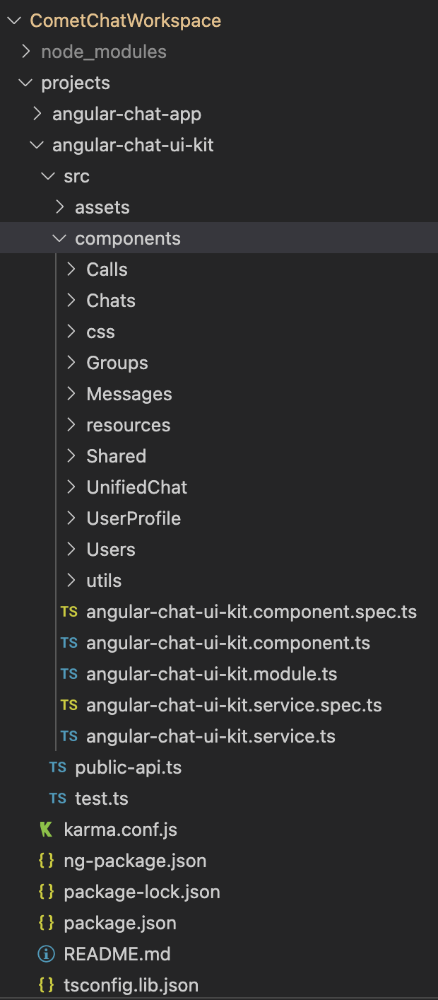

<div style="width:100%">
    <div style="width:50%;">
        <div align="center">
        <a href="#"> </a>   
        </div>    
    </div>    
</div>

<br/><br/>

# CometChat Angular UI Kit


</br></br>

<div style="width:100%">
    <div style="width:50%; display:inline-block">
        <div align="center">
              
        </div>    
    </div>    
</div>

</br></br>
CometChat Angular UI Kit is a collection of custom UI Components designed to build text chat and voice/video calling features in your application. 

The UI Kit is developed to keep developers in mind and aims to reduce development efforts significantly. 

---

## Features

- Private(1-1) & Group Conversations
- Voice & video calling & conferencing
- Rich Media Attachments
- Typing Indicators
- Text, Media and Custom messages
- Read receipts
- Online Presence Indicators
- Message History
- Users & Friends List
- Search by users and groups
- Groups List
- Conversations List
- Threaded Conversations

## Extensions

[Thumbnail Generation](https://prodocs.cometchat.com/docs/extensions-thumbnail-generation) | [Link Preview](https://prodocs.cometchat.com/docs/extensions-link-preview) | [Rich Media Preview](https://prodocs.cometchat.com/docs/extensions-rich-media-preview) | [Smart Reply](https://prodocs.cometchat.com/docs/extensions-smart-reply)| [Emojis](https://prodocs.cometchat.com/docs/extensions-emojis) | [Polls](https://prodocs.cometchat.com/docs/extensions-polls) | [Reactions](https://prodocs.cometchat.com/docs/extensions-reactions) | [Stickers](https://prodocs.cometchat.com/docs/extensions-stickers)

---

## Prerequisites

Before you begin, ensure you have met the following requirements:

- A text editor, to write code in. This could be a text editor (e.g. [Visual Studio Code](https://code.visualstudio.com/), [Notepad++](https://notepad-plus-plus.org/), [Sublime Text](https://www.sublimetext.com/), [Atom](https://atom.io/), or [VIM](https://www.vim.org/))

- [Node](https://nodejs.org/)

- [npm](https://www.npmjs.com/get-npm)

- Angular CLI `npm install -g @angular/cli`

---

## Installing Angular UI Kit

## 1. Setup

### i. Register on CometChat 🔧

To install Angular UI Kit, you need to first register on CometChat Dashboard. <a href="https://app.cometchat.com/" target="_blank">Click here to sign up</a>

### ii. Get your Application Keys :key:

- Create a new app
- Head over to the Quick Start or API & Auth Keys section and note the `App ID`, `Auth Key`, and `Region`.

### iii. Add the CometChat Dependency

```javascript
  npm install @cometchat-pro/chat@2.2.1 --save
```

<br/>

## 2. Configure CometChat inside your app

### i. Import CometChat SDK

```javascript
import { CometChat } from "@cometchat-pro/chat";
```

### ii. Initialize CometChat 🌟

The `init()` method initializes the settings required for CometChat.
We suggest calling the `init()` method on app startup, preferably in the `main.ts`, wrapping the `platformBrowserDynamic().bootstrapModule(AppModule)` as shown below.

```javascript
const appID = "APP_ID";
const region = "REGION";
const appSetting = new CometChat.AppSettingsBuilder()
  .subscribePresenceForAllUsers()
  .setRegion(region)
  .build();
CometChat.init(appID, appSetting).then(
  () => {
    console.log("Initialization completed successfully");
    // You can now call login function.
    platformBrowserDynamic()
      .bootstrapModule(AppModule)
      .catch((err) => console.error(err));
  },
  (error) => {
    console.log("Initialization failed with error:", error);
    // Check the reason for error and take appropriate action.
  }
);
```

**Note:**</br>

- Replace APP_ID and REGION with your CometChat `App ID` and `Region` in the above code.

### iii. Login your user 👤

This method takes `UID` and `Auth Key` as input parameters and returns the User object containing all the information of the logged-in user..

```javascript
const authKey = "AUTH_KEY";
const uid = "SUPERHERO1";

CometChat.login(uid, authKey).then(
  (user) => {
    console.log("Login Successful:", { user });
  },
  (error) => {
    console.log("Login failed with exception:", { error });
  }
);
```

**Note:** </br>

- Replace `AUTH_KEY` with your CometChat `Auth Key` in the above code.

- We have setup 5 users for testing having UIDs: `SUPERHERO1`, `SUPERHERO2`, `SUPERHERO3`,`SUPERHERO4` and `SUPERHERO5`.

<br/>

## 3. Add UI Kit to your project

- Clone this repository `git clone https://github.com/cometchat-pro/cometchat-pro-angular-ui-kit.git`
- Copy the cloned repository into your project src folder.

<div style="width:100%">
    
</div>

- Import the Components in the respective module where the component will be used.
- Install @ctrl/ngx-emoji-mart according to the angular version of your project [@ctrl/ngx-emoji-mart](https://www.npmjs.com/package/@ctrl/ngx-emoji-mart)
- Add this styles to your `angular.json`

```
"styles": [
  "node_modules/@ctrl/ngx-emoji-mart/picker.css",
  "src/cometchat-pro-angular-ui-kit/CometChatWorkspace/projects/angular-chat-ui-kit/src/css/styles.scss"
]
```

- Wrap all the selectors in a `div` with `class=responsive` as shown in next step

<br/>

## 4. Launch Cometchat

Using the CometChatUI component from the UI Kit, you can launch a fully functional chat application.
In this component all UI Components are interlinked and work together to launch a fully functional chat on your website/application.

**Import the CometChat in the required module**

```html
import { CometChatUI } from
"../components/CometChatUI/CometChat/cometchat-ui.module";
```

**Use this selector in your html file**

```
<div class="responsive">
  <CometChatUI></CometChatUI>
</div>

```

---

# Checkout our sample app

Visit our [Angular sample app](https://github.com/cometchat-pro/cometchat-pro-angular-sample-app) repo to run the Angular sample app.

---

# Troubleshooting

- To read the full documentation on UI Kit integration visit our [Documentation](https://prodocs.cometchat.com/docs/js-angular-ui-kit).

- Facing any issues while integrating or installing the UI Kit please <a href="https://app.cometchat.com/" target="_blank"> connect with us via real time support present in CometChat Dashboard.</a>

---

# Contact :mailbox:

Contact us via real time support present in [CometChat Dashboard](https://app.cometchat.com/).

---
